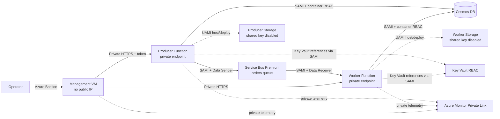

# Private Azure VNet Functions Lab

This repository builds a deployable, passwordless Azure lab in which two private Python Function Apps communicate through Service Bus and persist orders in Cosmos DB. Every supported PaaS data plane uses a private endpoint and private DNS. The only deliberate public ingress is Azure Bastion itself; the management VM has no public IP.

The implementation uses Terraform, Azure Functions Flex Consumption, user-assigned and system-assigned managed identities, Azure RBAC, Key Vault references, Log Analytics/Application Insights through Azure Monitor Private Link, and a Bastion-only management VM.

> **Cost warning:** Service Bus Premium, Bastion Standard, and the NAT Gateway have fixed hourly costs. Deploy the lab for a focused exercise and destroy it when finished.

## Architecture



Request flow:

1. From the management VM, `POST /api/orders` on the producer.
2. The producer creates the order in Cosmos DB and sends a deduplicated Service Bus message.
3. The worker's Service Bus trigger processes the message idempotently and updates the order.
4. From the VM, `GET /api/orders/{id}` on the worker returns the processed record.

[The detailed resource, identity, subnet, and DNS design is in `docs/architecture.md`.](docs/architecture.md)

## What gets built

- One `/16` VNet with a delegated `/26` Flex integration subnet, management subnet, `AzureBastionSubnet`, and isolated private-endpoint subnets for Functions, Storage, Service Bus, Cosmos DB, Key Vault, and Azure Monitor.
- Two Linux Flex Consumption plans and Function Apps, each with private inbound access and VNet-integrated outbound access.
- Two GPv2 Function host/deployment Storage accounts. Public access, anonymous access, and Shared Key authorization are disabled.
- Service Bus Premium with local authentication disabled and a duplicate-detecting queue.
- Serverless Cosmos DB with local/key authentication disabled and RBAC assignments scoped to the orders container.
- RBAC-mode Key Vault containing an API client token and passwordless Cosmos connection endpoint. Both are consumed as Function App Key Vault references.
- A Linux management VM with only a private NIC, protected by an NSG and reached through Bastion Standard. Its private subnet uses an explicit outbound-only NAT Gateway for operating-system bootstrap and deployment tooling.
- Log Analytics, workspace-based Application Insights, AMPLS, a private Data Collection Endpoint, resource diagnostic settings, Azure Monitor Agent, and a Linux performance/syslog DCR.
- Packaging, private deployment, DNS validation, and end-to-end smoke-test scripts.

Azure does not support a private endpoint on every resource type. VMs are natively attached by a private NIC, and VNets, identities, private DNS zones, and Bastion do not expose Private Link. Bastion Standard has a public IP by design while the target VM stays private. See [Microsoft's Bastion private-only guidance](https://learn.microsoft.com/azure/bastion/private-only-deployment) if a VPN/ExpressRoute-connected Bastion Premium design is required.

## Prerequisites

- An Azure subscription where you can create the listed resources and role assignments. `Contributor` plus `User Access Administrator` at the target subscription is the usual lab permission set.
- Permission to register the resource providers listed in `terraform/providers.tf`, especially `Microsoft.App` for Flex VNet integration.
- Azure CLI, Terraform 1.8 or later, PowerShell 7, and OpenSSH.
- A Flex-supported region. The default is `australiaeast`; verify with `az functionapp list-flexconsumption-locations -o table`.
- If the workload region has no Cosmos DB capacity, set `cosmos_location` to another subscription-policy-allowed region. The Cosmos private endpoint remains in the workload VNet.
- `function_runtime_version` can pin a Flex-supported Python runtime when a regional runtime has an indexing issue.
- An SSH key. Create one with `ssh-keygen -t ed25519 -f ~/.ssh/vnetlab -C vnetlab`.

## Deploy the infrastructure

```powershell
az login
$env:ARM_SUBSCRIPTION_ID = az account show --query id -o tsv

Copy-Item terraform/terraform.tfvars.example terraform/terraform.tfvars
# Edit terraform/terraform.tfvars and paste the SSH public key. Leave the
# subscription_id line commented when using ARM_SUBSCRIPTION_ID.

terraform -chdir=terraform init
terraform -chdir=terraform fmt -check -recursive
terraform -chdir=terraform validate
terraform -chdir=terraform plan -out=vnetlab.tfplan
terraform -chdir=terraform apply vnetlab.tfplan
```

The first apply can run from outside the VNet because Terraform creates the locked deployment containers and Key Vault secrets through Azure Resource Manager child resources rather than their inaccessible data-plane endpoints. The generated API token is still present in Terraform state; protect the state file. The optional DevOps phase explains how to migrate to an encrypted Azure backend.

Role assignments may take several minutes to propagate. The Function resources can exist before their new system identities can resolve Key Vault references; the private deployment script explicitly refreshes those references.

## Connect through Bastion and deploy the code

Get the generated tunnel command:

```powershell
terraform -chdir=terraform output -raw bastion_tunnel_command
```

Run that command in one terminal. In another, archive only the committed source, copy it through the tunnel, and connect. This deliberately excludes local state, plans, credentials, and virtual environments:

```powershell
git archive --format=zip --output=vnetlab-source.zip HEAD
scp -P 2222 -i ~/.ssh/vnetlab vnetlab-source.zip azureadmin@127.0.0.1:~/
ssh -p 2222 -i ~/.ssh/vnetlab azureadmin@127.0.0.1
```

On the VM:

```bash
mkdir -p ~/vnetlab
unzip -q ~/vnetlab-source.zip -d ~/vnetlab
rm -f ~/vnetlab-source.zip
cd ~/vnetlab
source /etc/profile.d/vnetlab.sh
az login --identity
bash scripts/deploy-functions.sh
bash scripts/vm-smoke-test.sh
```

The smoke test resolves both app hostnames to private addresses, checks that both apps' configuration and Key Vault references are ready, submits an order, and polls the worker API until Service Bus processing changes it to `processed`. The final transaction is the dependency-readiness test; `/api/health` intentionally reports configuration health only.

## Verify the security controls

From the VM, the normal Azure service hostnames should resolve to `10.42.0.0/16` addresses:

```bash
nslookup "$VNETLAB_PRODUCER_APP.azurewebsites.net"
nslookup "$VNETLAB_WORKER_APP.azurewebsites.net"
```

From a workstation that is not connected to the VNet, Function, Storage, Key Vault, Service Bus, Cosmos, and Azure Monitor data-plane access should fail. Azure Resource Manager commands such as `az resource show` still work; private endpoints protect data-plane traffic, not the Azure control plane.

Useful control checks:

```powershell
az storage account show -g <resource-group> -n <storage-name> `
  --query "{public:publicNetworkAccess,sharedKey:allowSharedKeyAccess,oauth:defaultToOAuthAuthentication}"

az functionapp show -g <resource-group> -n <function-name> `
  --query "{public:publicNetworkAccess,subnet:virtualNetworkSubnetId,identity:identity}"
```

See [`docs/operations.md`](docs/operations.md) for RBAC checks, Key Vault reference status, private DNS tests, Service Bus dead-letter inspection, and Log Analytics queries.

## Local quality checks

```powershell
python -m venv .venv
./.venv/Scripts/pip install -r requirements-dev.txt `
  -r functions/producer/requirements.txt `
  -r functions/worker/requirements.txt
./.venv/Scripts/pip check
./.venv/Scripts/ruff format --check functions tests
./.venv/Scripts/ruff check functions tests
./.venv/Scripts/pytest

Push-Location functions/producer
..\..\.venv\Scripts\python.exe -c "import function_app; assert len(function_app.app.get_functions()) == 2"
Pop-Location
Push-Location functions/worker
..\..\.venv\Scripts\python.exe -c "import function_app; assert len(function_app.app.get_functions()) == 3"
Pop-Location

terraform -chdir=terraform fmt -check -recursive
terraform -chdir=terraform init -backend=false
terraform -chdir=terraform validate
terraform -chdir=terraform test
```

## Azure DevOps follow-up

The management VM is already the correct network location for private SCM/Kudu and private Terraform data-plane operations. [`docs/azure-devops.md`](docs/azure-devops.md) explains how to:

- register it as a self-hosted Azure Pipelines agent without persisting the registration PAT;
- migrate Terraform state to an Entra-authenticated Azure Storage backend;
- use a service connection for infrastructure and the VM identity for private Function deployment;
- protect apply with an Azure DevOps Environment approval.

The repository separates trust boundaries into `azure-pipelines.yml` (credential-free CI on a Microsoft-hosted agent) and `azure-pipelines.deploy.yml` (manual, protected-main deployment on the private VM agent). Backend examples and `scripts/bootstrap-ado-agent.sh` support that phase.

GitHub Actions runs the same Terraform, Python, Function-indexing, and shell checks from `.github/workflows/ci.yml`. A ready-to-adapt AI-engineering CV entry is in [`docs/cv-project-entry.md`](docs/cv-project-entry.md).

## Cleanup

Review the destroy plan before applying it:

```powershell
terraform -chdir=terraform plan -destroy -out=destroy.tfplan
terraform -chdir=terraform apply destroy.tfplan
```

Key Vault purge protection is intentionally enabled. Destroy schedules the vault for deletion but cannot purge it; its randomized name avoids collisions during later lab runs.

## Primary references

- [Azure Functions networking options](https://learn.microsoft.com/azure/azure-functions/functions-networking-options)
- [Identity-based Functions connections](https://learn.microsoft.com/azure/azure-functions/manage-connections)
- [App Service Key Vault references](https://learn.microsoft.com/azure/app-service/app-service-key-vault-references)
- [Private endpoint DNS zones](https://learn.microsoft.com/azure/private-link/private-endpoint-dns)
- [Service Bus Private Link](https://learn.microsoft.com/azure/service-bus-messaging/private-link-service)
- [Azure Monitor Private Link](https://learn.microsoft.com/azure/azure-monitor/fundamentals/private-link-configure)
- [Azure diagnostic settings](https://learn.microsoft.com/azure/azure-monitor/platform/diagnostic-settings)
- [Default outbound access and private Azure subnets](https://learn.microsoft.com/azure/virtual-network/ip-services/default-outbound-access)
